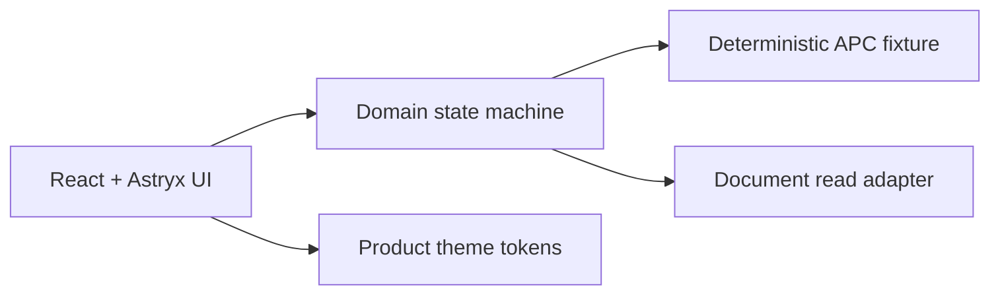
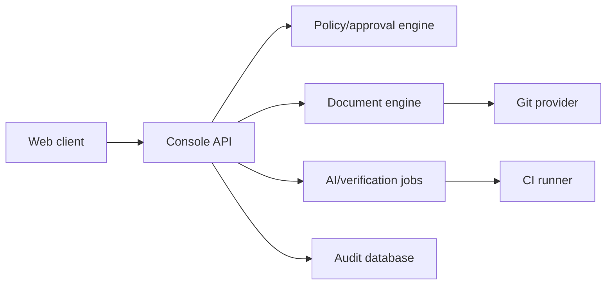

# Architecture

## Frontend architecture: Feature-Sliced Design

프론트엔드는 Feature-Sliced Design(FSD)을 공식 구조로 사용한다. 기존 Phase 0의 `domain/adapters` 중심 구조는 Phase 0.1에서 아래 계층으로 이관한다.

```text
src/
├── app/                 # bootstrap, providers, router, global styles
├── pages/               # route composition; business logic 금지
├── widgets/             # 독립적인 대형 UI block과 shell
├── features/            # 사용자의 완료 가능한 행동 단위
├── entities/            # Project, ChangeRequest, Context, Evidence
└── shared/              # UI wrapper, API client, config, lib, tokens
```

의존 방향은 `app → pages → widgets → features → entities → shared`다. 하위 layer는 상위 layer를 import하지 않으며, slice 간 직접 참조는 public API인 `index.ts`를 통한다. `shared`에는 업무 도메인 이름을 둬서는 안 된다.

대표 배치:

| 대상 | 위치 |
| --- | --- |
| route/provider/theme composition | `app/` |
| 메인·프로젝트 개요 route | `pages/landing`, `pages/project-overview` |
| public header·operational shell·attention queue | `widgets/` |
| 변경 요청 등록·승인·검증 실행 | `features/` |
| project aggregate와 repository contract | `entities/project/` |
| Astryx wrapper·theme utility·router utility | `shared/` |

## 최초 구현



- 백엔드 없이도 5분 end-to-end flow를 재현한다.
- fixture는 단순 화면별 mock이 아니라 ChangeRequest aggregate와 state transition event로 구성한다.
- `localStorage`는 demo session 복원에만 사용하며 source of truth로 표현하지 않는다.

## 운영 확장 경계



서버가 필요해지는 기능은 인증·다중 사용자·Git write·실제 AI·정책 강제·테스트 실행이다. 클라이언트에서 API key, Git token, 승인 권한을 보관하지 않는다.

## Adapter contracts

- `ProjectRepository`: project dashboard projection 조회. fixture/HTTP adapter가 같은 parser와 비동기 결과 계약을 사용한다.
- `AnalysisProvider`: request → proposal
- Phase 4 frontend 구현에서는 `AnalysisRepository`가 start/poll/retry/detail job contract를 소유하고, 실제 LLM provider는 backend application layer 뒤에 둔다.
- `DocumentProvider`: structured/raw document와 relation 조회
- `ReviewRepository`: decision 저장과 revision lock
- `VerificationProvider`: test run과 evidence 조회
- `ActivationService`: completion gate 확인 후 Context 활성화

fixture와 실제 구현은 같은 interface를 사용한다.

운영 구현에서는 React Static Site, FastAPI Web Service, PostgreSQL을 Render Blueprint 하나로 배포한다. 승인된 문서 원본은 Git, workflow·audit·draft metadata는 PostgreSQL이 소유한다. Render runtime filesystem은 source of truth가 아니다.

## Styling boundary

- Astryx는 접근 가능한 control과 component behavior를 소유한다.
- Astryx가 제공하는 layout·spacing·responsive·theme API를 먼저 사용한다.
- 제품 semantic token은 CSS variable이 단일 원본이며 제품 고유 shell과 composition만 얇은 CSS layer에서 작성한다.
- Astryx component 내부를 임의 CSS로 덮지 않고 `shared/ui` wrapper의 공식 prop과 className 경계만 사용한다.
- Tailwind CSS는 기본 설치하지 않는다. Astryx와 제품 CSS만으로 반복 비용이나 결손이 측정된 경우 별도 ADR과 spike 승인을 거쳐 재검토한다.
- 임의 color, radius, shadow, `!important`와 깊은 내부 selector override를 금지한다.

## Theme mode

`ThemePreference = "system" | "light" | "dark"`를 사용한다. 사용자 설정은 preference이며 실제 적용 mode는 system preference를 해석한 `light | dark`다.

- 초기 기본값은 `system`이다.
- 선택은 versioned local storage key에 저장하되 보안·업무 데이터는 저장하지 않는다.
- 첫 paint 전에 적용 mode를 결정해 theme flash를 줄인다.
- Astryx `Theme` mode와 document `data-theme`/`color-scheme`을 하나의 provider에서 동기화한다.
- OS theme 변경은 preference가 `system`일 때 즉시 반영한다.
- theme 변경은 업무 상태나 route state를 초기화하지 않는다.
