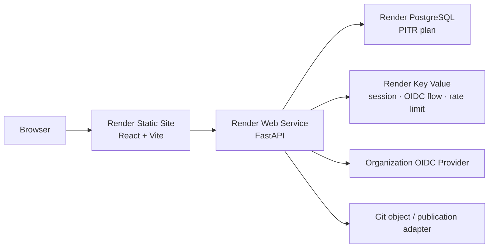

# Render Deployment Architecture

## Production topology

repository root의 `render.yaml`이 production과 pull-request preview를 함께 정의한다. 한 Blueprint로 동기화하되 runtime과 영속 상태를 분리한다.

| Resource | Production | Preview | 책임 |
| --- | --- | --- | --- |
| `context-console-web` | Static Site | fixture data, auth off | SPA, CSP/security headers, API origin |
| `context-console-api` | Starter Web Service | free, `APP_ENV=preview` | API, OIDC/session/RBAC, migration, Git/docs |
| `context-console-db` | paid Postgres `basic-256mb` | free | application/audit state, production PITR |
| `context-console-security` | persistent Starter Key Value | free | session, one-time flow, shared rate-limit |

API는 `docs/`를 Git object로 읽기 때문에 repository root를 Render `rootDir`로 유지하고 명령에서 API directory로 이동한다. frontend는 자체 project root에서 build한다. React Router는 `/* → /index.html`, API health check는 `/health/ready`를 사용한다.

## 배포와 환경 분리

- production auto deploy는 `checksPass`; 실패한 CI commit은 배포하지 않는다.
- preview는 3일 후 만료하고 frontend fixture/auth off로 운영 계정과 production 데이터 의존을 제거한다.
- production migration은 pre-deploy `alembic upgrade head`; production seed는 실행하지 않는다.
- frontend build-time 변수는 public으로 간주한다. secret은 API의 `sync: false` 변수에만 둔다.
- web CSP의 `connect-src`와 `form-action`, API CORS와 `FRONTEND_ORIGINS`, IdP callback은 exact production URL로 함께 변경한다.
- Web Service filesystem은 ephemeral이다. application/audit는 Postgres, 승인 문서는 Git, session/rate state는 Key Value가 소유한다.

| Key | Production 계약 | Secret |
| --- | --- | --- |
| `VITE_API_BASE_URL`, `VITE_AUTH_REQUIRED` | API public URL, `true` | 아니오 |
| `APP_ENV`, `LOG_LEVEL` | `production`, `INFO` | 아니오 |
| `DATABASE_URL` | Blueprint database connection reference | 예 |
| `SECURITY_STORE_URL` | Blueprint Key Value connection reference | 예 |
| `CORS_ALLOWED_ORIGINS`, `FRONTEND_ORIGINS` | frontend HTTPS origin exact allowlist | 아니오 |
| `OIDC_ISSUER`, `OIDC_CLIENT_ID`, `OIDC_CALLBACK_URL` | IdP/API exact metadata | client ID는 비밀 아님 |
| `OIDC_CLIENT_SECRET`, `OIDC_ROLE_MAPPING` | Render secret input | 예/정책 제한 |
| `SESSION_COOKIE_*`, `SESSION_TTL_SECONDS` | Secure, SameSite None, 8시간 | 아니오 |

## Validation gate

1. local frontend/backend quality gate
2. JSON Schema validation of `render.yaml`
3. Render CLI workspace validation: `render blueprints validate render.yaml --output json`
4. preview migration, readiness, CORS, SPA rewrite, test-tenant OIDC
5. production migration and read-only smoke
6. production role/account smoke and 15-minute observation

Schema 검증은 문법·필드 형태만 확인한다. 실제 workspace의 이름 충돌, secret 입력, 요금제 생성 권한은 Render CLI/dashboard 단계에서 확인한다. 실제 실행 절차와 rollback/PITR 판단은 `production-runbook.md`를 따른다.

## 공식 참고

- [Render Blueprint specification](https://render.com/docs/blueprint-spec)
- [Render CLI Blueprint validation](https://render.com/docs/cli-reference)
- [Render Key Value](https://render.com/docs/key-value)
- [Render PostgreSQL backups](https://render.com/docs/postgresql-backups)
- [Render deploy rollbacks](https://render.com/docs/rollbacks)
