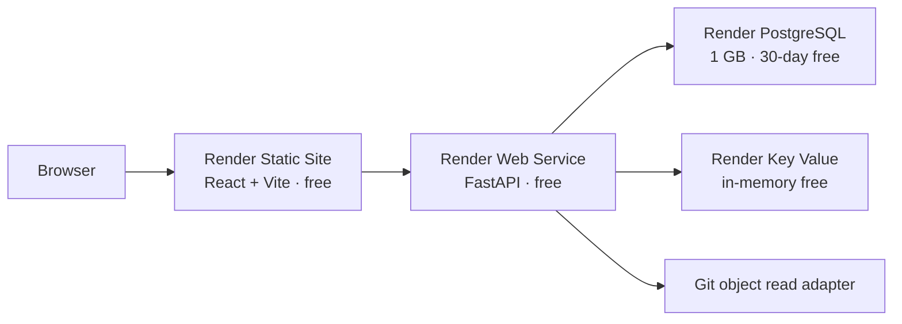

# Render Deployment Architecture

## 활성 배포 프로필: zero-cost initial demonstration

repository root의 `render.yaml`은 `imugi` workspace에 결제 수단 없이 초기 시연 환경을 생성하는 단일 Blueprint다. 이 프로필은 제품 기능과 web→API→DB 연결을 검증하기 위한 비운영 환경이며 Phase 9의 유료 production topology를 대체하거나 완료로 판정하지 않는다.

| Resource | 활성 plan | 책임 | 무료 제약 |
| --- | --- | --- | --- |
| `context-console-web` | Static Site free | SPA, security headers, API origin | 포함 bandwidth·pipeline 한도 |
| `context-console-api` | Web Service `free` | HTTP API, migration, Git/docs read | 15분 idle 후 spin-down·cold start |
| `context-console-db` | PostgreSQL `free` | application/audit state | 1 GB, 30일 만료, backup/PITR 없음 |
| `context-console-security` | Key Value `free` | shared transient state | disk persistence 없음, restart 시 소실 |

API는 `docs/`를 Git object로 읽기 때문에 repository root를 Render `rootDir`로 유지하고 명령에서 API directory로 이동한다. frontend는 자체 project root에서 build한다. React Router는 `/* → /index.html`, API health check는 `/health/ready`를 사용한다.

## 과금 차단 규칙

- Blueprint의 모든 instance `plan`은 `free`이며 Static Site도 free다.
- Blueprint Environment Preview와 개별 Service Preview를 비활성화한다. `previewPlan`을 선언하지 않는다.
- 결제 수단을 등록하지 않는다. 포함 사용량 초과 시 Render는 추가 과금 대신 service 또는 build를 중지한다.
- Blueprint sync 전에 Render CLI workspace validation 결과가 `valid: true`인지 확인한다.
- plan 변경, paid disk, paid pipeline, preview 활성화는 별도 비용 승인과 Change Manifest 없이는 금지한다.

## 초기 시연 런타임

- frontend는 `VITE_DATA_SOURCE=http`, `VITE_AUTH_REQUIRED=false`로 API에 연결한다.
- API는 `APP_ENV=preview`를 사용하므로 조직 OIDC secret 없이 비운영 actor adapter를 사용한다.
- 무료 Web Service는 `preDeployCommand`를 지원하지 않는다. 단일 free instance의 `startCommand`에서 `alembic upgrade head`를 실행한 뒤 Uvicorn을 시작한다.
- production seed는 실행하지 않는다. 필요한 시연 데이터는 명시적인 fixture/초기화 절차로만 준비한다.
- Web Service filesystem은 ephemeral이다. 문서 수정의 remote push는 수행하지 않으며 DB/KV 상태는 무료 플랜 제약을 따른다.

| Key | 초기 시연 계약 | Secret |
| --- | --- | --- |
| `VITE_API_BASE_URL` | Render API HTTPS origin | 아니오 |
| `VITE_DATA_SOURCE`, `VITE_AUTH_REQUIRED` | `http`, `false` | 아니오 |
| `APP_ENV`, `LOG_LEVEL` | `preview`, `INFO` | 아니오 |
| `DATABASE_URL` | Blueprint free Postgres connection reference | 예, 자동 연결 |
| `SECURITY_STORE_URL` | Blueprint free Key Value connection reference | 예, 자동 연결 |
| `CORS_ALLOWED_ORIGINS`, `FRONTEND_ORIGINS` | frontend Render HTTPS origin | 아니오 |

## Validation gate

1. local frontend/backend quality gate
2. JSON Schema validation of `render.yaml`
3. `imugi` workspace validation: `render blueprints validate render.yaml -w tea-d9gnd7jtqb8s73drjjlg -o json`
4. Blueprint 비용 검토: paid plan·preview·disk·paid pre-deploy 0건
5. initial deploy 후 migration, `/health/live`, `/health/ready`, CORS, SPA rewrite smoke
6. 무료 DB 만료일과 시연 데이터 폐기 계획 기록

Schema 검증은 문법·필드 형태만 확인한다. Render CLI workspace 검증은 현재 workspace의 플랜·권한·필드 조합을 확인하며 실제 자원은 생성하지 않는다. Blueprint 생성은 별도의 외부 상태 변경 단계다.

## Production 전환 경계

조직 OIDC, fail-closed production auth, persistent session/rate state, backup/PITR, pre-deploy migration, 무중단 운영이 필요해지면 `production-runbook.md`의 유료 profile로 별도 변경한다. 무료 초기 배포를 production 완료 증거로 사용하지 않는다.

## 공식 참고

- [Render free instances](https://render.com/docs/free)
- [Render Blueprint specification](https://render.com/docs/blueprint-spec)
- [Render deploy and pre-deploy commands](https://render.com/docs/deploys)
- [Render CLI Blueprint validation](https://render.com/docs/cli-reference)
