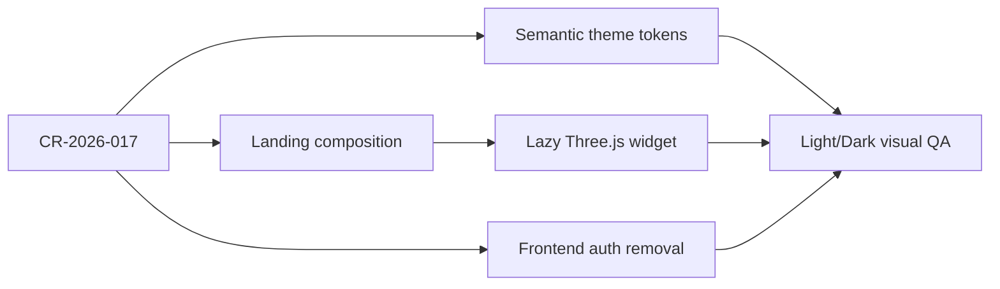

# 2026-07-23 Theme·Landing motion·인증 범위 영향 분석

| 영역 | 영향 | 대응 |
| --- | --- | --- |
| Design system | theme별 직접 보정 제거, semantic token contract 확대 | token 표와 source CSS를 동일 이름으로 고정하고 양 테마 대비 검증 |
| Public landing | 정적 preview 중심에서 WebGL hero와 3개 workflow scene으로 재구성 | landing page는 조합만 담당하고 motion은 독립 widget이 소유 |
| Runtime | Three.js bundle·GPU·animation lifecycle 추가 | dynamic import, viewport/visibility/reduced-motion gate, capped DPR, dispose 적용 |
| Accessibility | canvas만으로 의미가 전달될 위험 | canvas는 장식으로 숨기고 같은 관계·상태를 HTML copy와 label로 제공 |
| Authentication | frontend login/session/logout 제거 | 직접 console 진입, 인증 관련 runtime env와 provider 제거 |
| Authorization | workflow guard와 로그인 권한의 혼동 가능 | fixture actor 기반 업무 규칙은 유지하고 실제 identity RBAC만 후속으로 연기 |
| Render | Static Site build-time 인증 flag 제거 | `VITE_AUTH_REQUIRED` 삭제, fixture data source 유지 |
| QA | theme·WebGL·reduced motion·로그인 부재 회귀 추가 | policy/unit/build/browser matrix에 명시 |

## 의존 관계

## 회귀 위험

- Three.js가 initial shell chunk에 합쳐져 performance budget을 초과할 수 있다.
- WebGL context를 route 이동 때 해제하지 않으면 GPU/RAF leak이 발생할 수 있다.
- `primary`가 light에서는 어둡고 dark에서는 밝다는 사실을 컴포넌트가 직접 해석하면 action foreground가 다시 깨질 수 있다.
- 인증 UI 제거 과정에서 approval domain permission까지 제거하면 제품의 핵심 governance가 손상된다.
