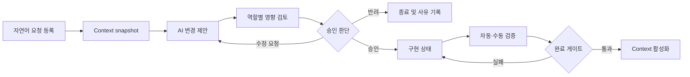

# User Flows

## FLOW-001 변경 요청에서 활성화까지

## FLOW-002 Context 탐색

1. 사용자가 역할 또는 문서 유형으로 필터한다.
2. 문서 목록에서 status, version, owner, updated time을 비교한다.
3. 문서 상세에서 요약, 구조화 필드, 상위 기준, 파생 산출물을 확인한다.
4. 필요할 때만 Markdown/YAML 원본과 Git 경로를 연다.

## FLOW-003 반려와 재제안

- 반려는 terminal 상태이며 사유가 필수다.
- 수정 요청은 원 요청을 덮어쓰지 않고 revision을 추가한다.
- AI 재분석은 기존 승인 범위를 자동 확대하지 않는다.
- 변경된 영향 범위에는 `changed since review` 표시를 제공한다.

## FLOW-004 검증 실패

- 실패한 test/evidence를 요청 상단과 Review에 동시에 노출한다.
- `READY_TO_ACTIVATE` 진입과 `ACTIVATED` 행동을 disabled 처리하고 이유를 제공한다.
- 재구현 후에는 이전 통과 결과를 현재 결과로 재사용하지 않는다.
