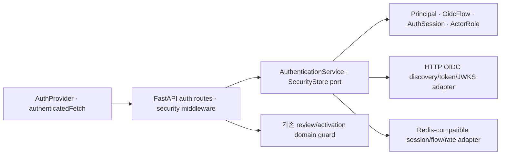

# DF-010 Production authentication and operations

## 목적

Phase 8까지의 domain permission·audit·revision gate를 production identity와 운영 인프라에 연결한다. 인증 공급자, session 저장소, HTTP middleware, 업무 RBAC, 배포 설정을 분리해 IdP나 hosting adapter가 바뀌어도 domain policy는 유지한다.

## 계층과 소유권

| Layer | 책임 | 금지 |
| --- | --- | --- |
| Domain | provider-neutral principal/session/flow, trusted claim→role | HTTP/cookie/Redis 의존 |
| Application | one-time flow, exact return allowlist, session lifecycle port | provider SDK model 노출 |
| Infrastructure | OIDC discovery/token/JWKS, Redis-compatible TTL/atomic counter | 업무 permission 판단 |
| API | cookie·CSRF·rate limit·request ID·security header 조합 | client role/header 신뢰 |
| Frontend shared/entity | credentialed fetch, CSRF, session state, login/logout | provider token 저장 |
| Render/operations | secret, paid state resource, checks gate, recovery | code에 secret literal |

## 인증 흐름

1. `/auth/login`이 HTTPS frontend origin exact allowlist를 검증한다.
2. server가 cryptographic state, nonce, PKCE verifier를 생성하고 TTL을 가진 one-time flow로 저장한다.
3. OIDC client는 discovery issuer와 HTTPS endpoint, PKCE S256 지원을 확인한다.
4. callback은 state를 원자적으로 소비하고 code+verifier를 교환한다.
5. ID token은 허용된 RS256/ES256, signature, issuer, audience, exp, iat, sub, nonce를 검증한다.
6. 신뢰된 claim/group만 내부 `ActorRole`로 변환하고 server session ID·CSRF token을 발급한다.
7. 브라우저에는 HttpOnly/Secure session cookie만 남기고 provider token은 반환하거나 보관하지 않는다.

## API 보안 경계

- production `/api/v1`은 auth route를 제외하고 session이 없으면 401이다.
- production은 `X-Actor-Id`를 identity로 사용하지 않는다. 검증된 principal을 기존 actor directory에 등록한다.
- mutation은 session-bound `X-CSRF-Token`이 없거나 다르면 403이다.
- 업무 permission, self-approval, completion/activation gate는 기존 domain이 다시 검사한다.
- read/write rate bucket은 raw IP 대신 actor ID 또는 IP hash를 쓰며 Key Value atomic counter로 instance 간 공유한다.
- 429에는 `Retry-After`, 모든 정상·거부 응답에는 동일 request ID와 security headers를 제공한다.
- access log는 actor ID, method, path, status, duration, denial code만 기록하고 query/body/header/cookie/token을 제외한다.

## Frontend session 상태

| 상태 | UI/행동 |
| --- | --- |
| loading | 조직 session 확인, protected route 미노출 |
| authenticated | Context 화면 렌더링, unsafe fetch에 CSRF 자동 첨부 |
| unauthenticated | 조직 login 링크와 권한 설명 |
| expired | protected API 401 broadcast 후 즉시 unauthenticated 전환 |
| error | 오류 세부와 deterministic retry |

로그아웃은 API session revoke 후 local CSRF를 제거한다. 데스크톱·모바일 운영 shell에서 로그아웃 동작을 노출하며 fixture/preview는 동일 provider 계약의 nonproduction adapter를 사용한다.

## Production topology와 fail-closed 설정

- `Settings`는 production에서 OIDC issuer/client/secret/callback, shared security store, Secure cookie, HTTPS frontend origin, 유효 role mapping이 없으면 시작을 거부한다.
- readiness는 database, migration, security store를 독립 field로 보고한다.
- Render Blueprint는 Static Site, Web Service, paid PostgreSQL, persistent Key Value를 선언한다.
- production deploy는 GitHub `quality-gate` checks 통과 후만 시작하고 migration은 seed 없는 pre-deploy로 실행한다.
- read-only `production_smoke`는 Web→SPA→API→DB migration/Key Value→anonymous auth boundary를 검증한다.

## 확장 지점

- 다른 IdP: `OidcClient` adapter 교체, domain/service 불변
- 다른 shared store: `SecurityStore` 구현 교체, session/rate contract 불변
- MFA/step-up: principal assurance claim과 high-risk domain policy를 별도 capability로 추가
- SIEM/APM: structured event sink 교체, log payload allowlist 불변
- multi-tenant: session principal에 verified organization scope를 추가하고 모든 repository query에 scope 강제

## 불변 조건

- production anonymous fallback과 actor header trust는 없다.
- return URL, issuer, callback은 exact allowlist다.
- access/id/refresh token은 browser storage, API response, application log에 없다.
- flow/session/rate key는 TTL을 갖고 one-time flow는 replay할 수 없다.
- 승인·evidence·publication·activation domain gate는 인증 middleware로 대체되지 않는다.
- application rollback은 database downgrade를 자동 실행하지 않는다.

## 연결

- Change: `CR-2026-013`
- Requirements: `REQ-AUTH-001~002`, `REQ-OPS-001~002`, `REQ-RECOVERY-001`, `REQ-DEPLOY-001`
- Impact: `impact-analysis/2026-07-23_phase-9-production-operations.md`
- QA: `roles/qa/feature/09_phase-9/01_production_operations_qa.md`
- Operations: `engineering/production-runbook.md`
